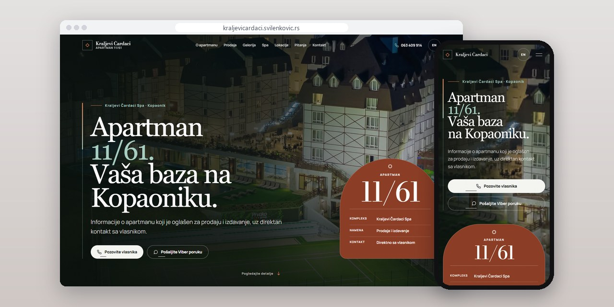
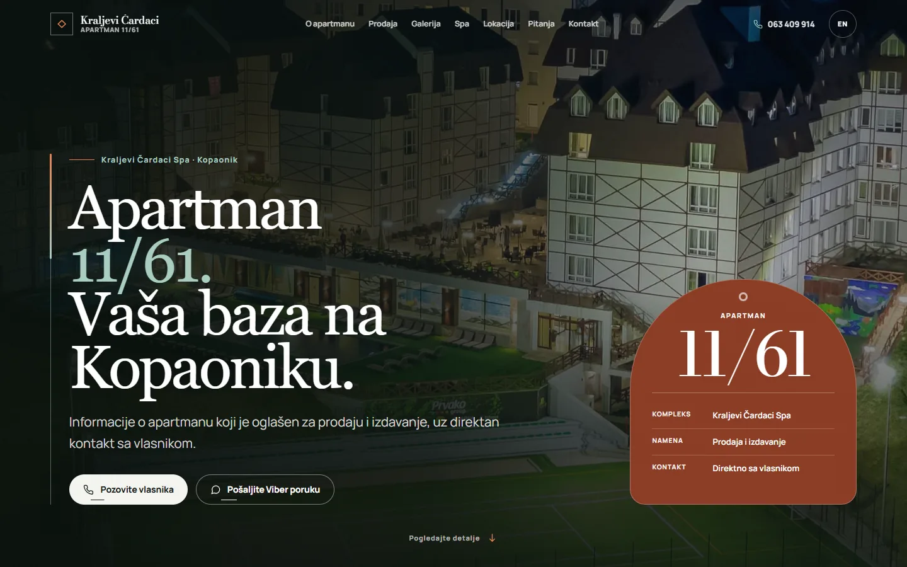
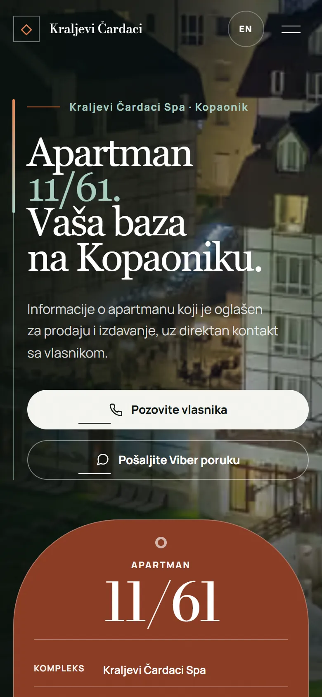
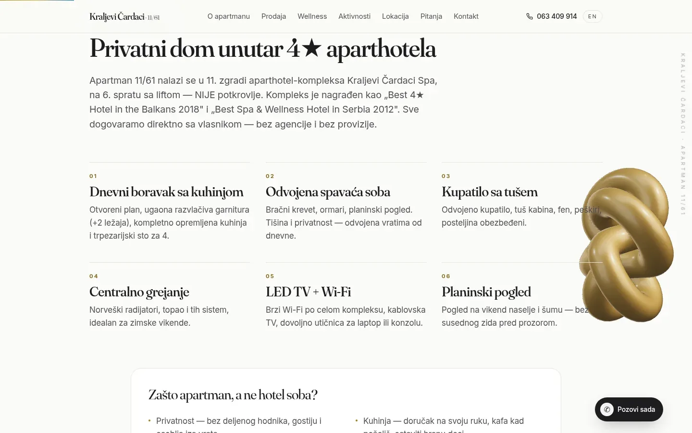
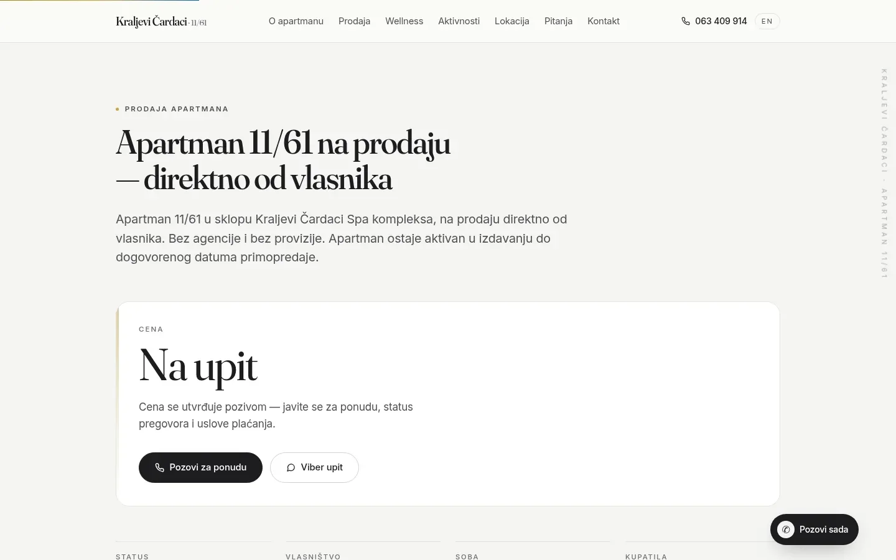

# Kraljevi Čardaci 11/61

One page in Serbian and English for an apartment that is for sale and for rent at once, in the Kraljevi Čardaci spa complex on Kopaonik.

**[kraljevicardaci.svilenkovic.rs](https://kraljevicardaci.svilenkovic.rs/)** · [Case study (in Serbian)](https://svilenkovic.com/radovi/kraljevi-cardaci) · [Srpski](README.sr.md)

> [!NOTE]
> Client project. The source code belongs to the client and stays in a private repository. This page describes what I built and how.

<table>
  <tr><td><b>Client</b></td><td>Apartment 11/61, Kraljevi Čardaci</td></tr>
  <tr><td><b>Industry</b></td><td>Apartment for sale and for rent</td></tr>
  <tr><td><b>Location</b></td><td>Kopaonik, Serbia</td></tr>
  <tr><td><b>Type</b></td><td>One-page bilingual website</td></tr>
  <tr><td><b>My role</b></td><td>Design, development, SEO, hosting and maintenance</td></tr>
  <tr><td><b>Stack</b></td><td>Next.js 16, React 19, next-intl, Tailwind</td></tr>
</table>

## About the project

Apartment 11/61 is in the Kraljevi Čardaci Spa complex on Kopaonik, and the owner sells it and rents it out at the same time, without an agency. One page has to serve two very different visitors: someone after a few nights in the mountains and someone thinking about buying property. Both end up at the same phone number, so the page tries to answer the questions each of them would ask before calling.

Price, availability and legal status change, so the page does not publish them and says so openly. Questions about them go to the owner. The gallery shows only the complex and its shared spa, with a note that these are not photos of the apartment's interior, and the footer states that this is not the complex's official site. Spa facilities link to the official source, since what the complex offers can change without notice.

## What I built

- Serbian at the root and English under `/en`, with hreflang pairs in the page head and in the sitemap
- No automatic switch by browser language: everyone gets Serbian first and moves to English with one click
- Texts, descriptions and FAQ in two translation files, with the English HTML searched for Serbian letters to catch leftovers
- An FAQ with the questions people ask before calling, also marked up as `FAQPage`
- Phone and Viber as the only contact, with no form and no inbox anyone has to watch
- Cross-links with the owner's second apartment in the centre of Kopaonik

## Results

| | Performance | Accessibility | Best practices | SEO |
| :-- | :-: | :-: | :-: | :-: |
| Mobile | 99 | 100 | 100 | 100 |
| Desktop | 96 | 100 | 100 | 100 |

PageSpeed Insights, lab test of the live site, September 2026. Security headers: 6 of 6. HTML validator: no errors. axe accessibility check: no violations. Structured data: `Apartment`, `FAQPage`, `Person`, `Resort`.

## Screenshots

<table>
  <tr>
    <td width="68%" valign="top"></td>
    <td width="32%" valign="top"></td>
  </tr>
</table>

About the apartment: six cards for the living room with kitchen, bedroom, bathroom, heating, TV and the view

For sale: price on request, by phone call or Viber instead of through an agency

---

Built by [D. Svilenković](https://svilenkovic.com).
